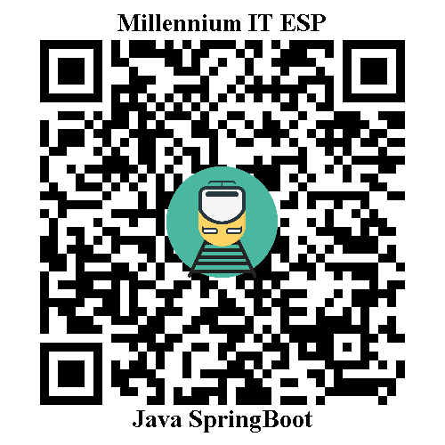

# QR Code Generator and Reader



This project is a Java Spring Boot application that provides functionalities for generating and reading QR codes. It uses the Google ZXing library for QR code encoding and decoding.

## Features

- Generate QR codes with customizable text and image overlays.
- Read QR codes and extract the encoded data.
- Simple and intuitive API endpoints for QR code generation and reading.


## Technologies Used

- Java
- Spring Boot
- Google ZXing
- OpenCV
- QRGen
- Lombok


## Getting Started

Follow these instructions to set up and run the project on your local machine.


### Prerequisites

- Java Development Kit (JDK) 11 or higher
- Apache Maven
- An IDE (e.g., IntelliJ IDEA, Eclipse)


### Installation

1. Clone the repository:

   ```shell
   git clone https://github.com/NirmalWi/QR-code-generator-and-reader.git
   
2. Navigate to the project directory:

   ```shell
   cd qr-code-generator-reader
   
3. Build the project using Maven:

   ```shell
   mvn clean install

### Usage

1. Start the Spring Boot application:

   ```shell
   mvn spring-boot:run

2. Open your web browser or use a REST client to access the following endpoints:

- To generate a QR code: http://localhost:8081/api/qr/gen
- To read a QR code: http://localhost:8081/api/qr/read
   
3. The generated QR code image will be saved to the specified file path (`file-path` in the [`application.yml`](src/main/resources/application.yml) configuration file).

4. The decoded text from the QR code will be printed in the console and returned as the response.
   
   
## Configuration

The project's configuration is managed through the `application.yml` file. It contains the server port and file paths for generating and reading QR codes. You can modify these settings to suit your environment.
   
## Contributing

Contributions are welcome! If you have any ideas, improvements, or bug fixes, please open an issue or submit a pull request.
   

## Acknowledgments

- [Google ZXing](https://github.com/zxing/zxing) - Library used for QR code encoding and decoding.
- [OpenCV](https://opencv.org/) - Computer vision library used for image processing.
- [QRGen](https://github.com/kenglxn/QRGen) - Library used for generating QR codes.
- [Spring Boot](https://spring.io/projects/spring-boot) - Framework used for developing the Java Spring Boot application.


## Contact

For any inquiries or feedback, please contact:

Nirmal Widanage<br>
Email: nirmalW@mitesp.com
